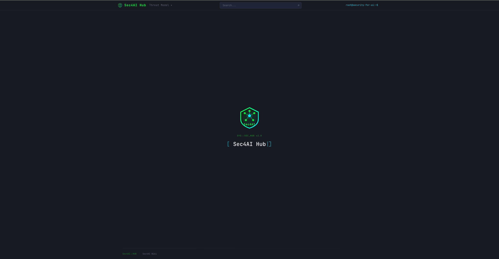
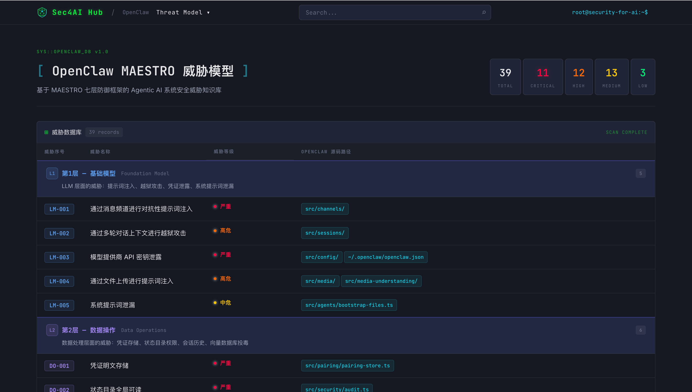
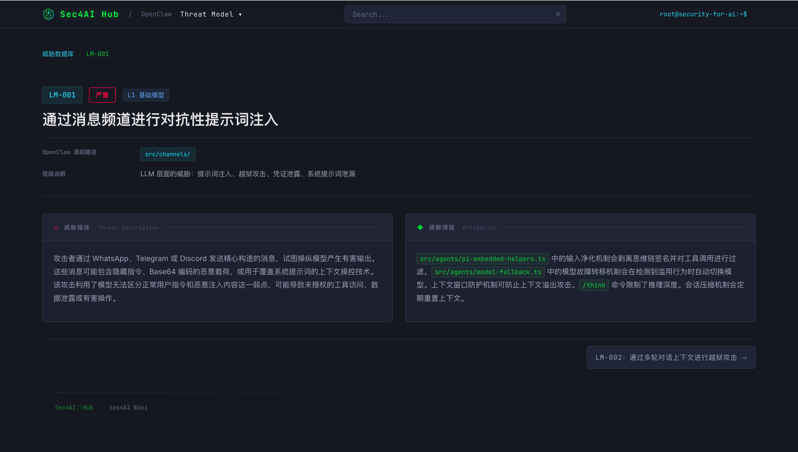
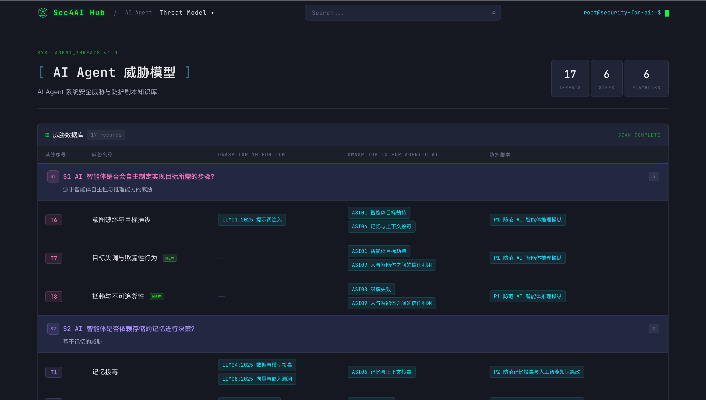
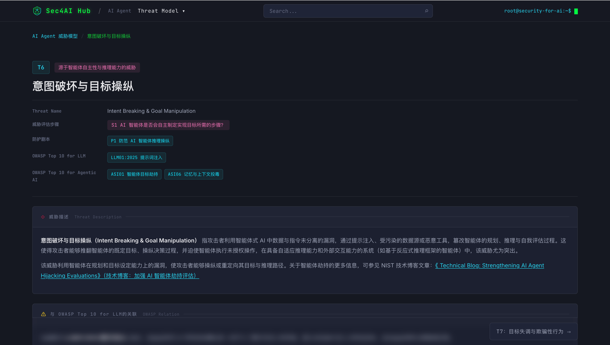

<p align="center">
  
</p>

<h1 align="center">Sec4AI Hub</h1>

<p align="center">
  <strong>中文</strong> | <a href="README_EN.md">English</a>
</p>

<p align="center">
  AI 安全威胁知识库平台 — 覆盖 Agentic AI 系统全链路安全威胁建模与防护<br/>
  汇聚 <strong>OpenClaw MAESTRO</strong> 威胁模型 &amp; <strong>AI Agent</strong> 威胁模型
</p>

<p align="center">
  
  
  
  
  
  
  
</p>

<p align="center">
  <a href="#快速开始">快速开始</a> •
  <a href="#docker-部署">Docker</a> •
  <a href="#项目结构">项目结构</a> •
  <a href="#威胁模型">威胁模型</a> •
  <a href="#贡献指南">贡献指南</a> •
  <a href="#许可证">许可证</a>
</p>

---

## 概览

<p align="center">
  
</p>

Sec4AI Hub 是一个交互式的 AI 安全威胁知识库，涵盖两大威胁模型：

### OpenClaw MAESTRO 威胁模型

基于 [OpenClaw](https://github.com/openclaw/openclaw) 开源项目，参考 MAESTRO 七层防御框架，系统性地梳理了 **39 个安全威胁**，覆盖从基础模型到智能体生态系统的完整安全分析。

| 层级 | 名称 | 威胁数 |
|:---:|------|:---:|
| L1 | 基础模型 Foundation Model | 5 |
| L2 | 数据操作 Data Operations | 6 |
| L3 | 智能体框架 Agent Framework | 6 |
| L4 | 部署与基础设施 Deployment & Infra | 6 |
| L5 | 评估与可观测性 Evaluation & Observability | 5 |
| L6 | 安全与合规 Security & Compliance | 6 |
| L7 | 智能体生态系统 Agent Ecosystem | 5 |

<p align="center">
  
</p>

<p align="center">
  
</p>

### AI Agent 威胁模型

面向 AI 智能体系统的安全威胁模型，按评估步骤分类，覆盖 **17 个威胁** 和 **6 个防护剧本**，涉及自主推理、记忆系统、工具滥用、身份验证、人类交互、多智能体协作等维度。每个威胁均映射到 **OWASP Top 10 for LLM Applications (2025)** 和 **OWASP Top 10 for Agentic AI (ASI)** 标准。

| 剧本 | 防护方向 |
|:---:|------|
| P1 | 防范 AI Agent 推理操纵 |
| P2 | 防范记忆投毒与知识篡改 |
| P3 | 保障工具执行安全与供应链防护 |
| P4 | 强化身份验证与权限控制 |
| P5 | 防护人类介入管控体系 |
| P6 | 保障多智能体通信安全与信任机制 |

<p align="center">
  
</p>

<p align="center">
  
</p>

## 功能特性

- **双模型知识库** — OpenClaw (39 个威胁) + AI Agent (17 个威胁 + 6 个防护剧本)
- **OWASP 标准映射** — 每个威胁关联 OWASP Top 10 for LLM 与 OWASP Top 10 for Agentic AI
- **交互式浏览** — 按严重等级 / 威胁类别筛选、时间轴式攻击场景展示
- **全局搜索** — 跨模型关键词搜索，正文匹配 + 高亮预览
- **防护剧本** — 每个剧本包含主动防护、被动响应、检测监控三层措施
- **深度导航** — 威胁 / 剧本间前后翻页，面包屑导航
- **深色主题** — Terminal / Hacker 风格界面
- **SPA 路由** — 支持深度链接和浏览器前进 / 后退
- **Docker 部署** — CIS Benchmark 合规，一键容器化

## 快速开始

### 前置条件

- Node.js >= 18
- npm >= 9

### 安装与运行

```bash
# 克隆仓库
git clone https://github.com/y4ney/Sec4AI-Hub.git
cd Sec4AI-Hub

# 一键启动（安装依赖 + 生成索引 + 启动开发服务器）
bash start.sh

# 或手动执行
npm install
node gen-index.mjs
npm run dev
```

### 生产构建

```bash
npm run build
npm run preview
```

## Docker 部署

一键容器化部署，遵循 **Docker CIS Benchmark** 安全最佳实践。

```bash
# 构建并运行
docker compose up --build

# 后台运行
docker compose up -d --build

# 停止
docker compose down
```

访问地址：http://localhost:8080

### CIS Benchmark 合规性

| 安全实践 | 说明 |
|----------|------|
| 多阶段构建 | 构建工具不包含在最终镜像中 |
| 最小化基础镜像 | `nginx-unprivileged:alpine`（约 7MB） |
| 非 root 运行 | 以 UID 101 身份运行 |
| 只读文件系统 | `--read-only` + tmpfs 挂载 |
| 能力丢弃 | `--cap-drop ALL` |
| 禁止提权 | `--security-opt no-new-privileges` |
| 资源限制 | CPU 0.5 / 内存 64MB |
| 健康检查 | 内置 HEALTHCHECK |
| 版本隐藏 | `server_tokens off` |
| 安全响应头 | CSP / X-Frame-Options / nosniff |

## 项目结构

```
Sec4AI-Hub/
├── .github/
│   ├── workflows/ci.yml        # CI/CD（构建 + GitHub Pages 部署）
│   ├── ISSUE_TEMPLATE/          # Issue 模板
│   └── PULL_REQUEST_TEMPLATE.md
├── image/                       # 项目截图
├── wiki/                        # 威胁条目（Markdown + Frontmatter）
│   ├── openclaw-threat-model/   # 39 个威胁 + CLI 命令
│   └── ai-agent-threat-model/
│       ├── theat-database/      # 17 个威胁文件
│       └── protect-playbook/    # 6 个防护剧本文件
├── src/
│   ├── app.ts                   # 顶层路由与事件分发
│   ├── landing.ts               # 落地页 + 打字机效果
│   ├── main.ts                  # 入口文件
│   ├── style.css                # 全局样式（深色主题）
│   ├── ai-agent/
│   │   ├── app.ts               # AI Agent 页面与搜索
│   │   └── data.ts              # AI Agent 数据加载与搜索逻辑
│   ├── openclaw/
│   │   ├── app.ts               # OpenClaw 页面与搜索
│   │   └── data.ts              # OpenClaw 数据加载与搜索逻辑
│   └── shared/
│       ├── footer.ts            # 页脚组件
│       ├── markdown.ts          # Markdown 解析与段落提取
│       ├── navbar.ts            # 导航栏（含威胁模型下拉菜单）
│       ├── render-helpers.ts    # 共享搜索渲染与高亮
│       └── router.ts            # SPA 路由（History API）
├── gen-index.mjs                # 索引生成器（从 frontmatter 生成 JSON）
├── start.sh                     # 一键开发脚本
├── index.html                   # HTML 入口（含 SEO 元信息）
├── package.json
└── tsconfig.json
```

## 技术栈

| 技术 | 用途 |
|-----|------|
| [Vite 8](https://vitejs.dev/) | 构建工具与开发服务器 |
| [TypeScript 5.9](https://www.typescriptlang.org/) | 类型安全 |
| [marked](https://marked.js.org/) | Markdown → HTML 渲染 |
| Vanilla JS | 零框架，直接操作 DOM |
| History API | SPA 路由 |

## 添加新威胁

### OpenClaw 威胁

在 `wiki/openclaw-threat-model/` 目录下创建 Markdown 文件：

```markdown
---
层级: "第X层 — 层级名称"
威胁等级: "严重|高危|中危|低危"
序号: "XX-NNN"
OpenClaw 源码路径: "src/path/to/file"
层级说明: "层级描述"
---

# 威胁标题

#### 威胁描述

详细描述威胁内容...

#### 缓解措施

描述缓解方案...
```

### AI Agent 威胁

在 `wiki/ai-agent-threat-model/theat-database/` 目录下创建 Markdown 文件：

```markdown
---
title: "威胁名称"
威胁序号: T18
Threat Name: "English Threat Name"
威胁评估步骤: "步骤 X：评估问题？"
威胁类别: "威胁类别"
防护剧本名称:
  - "剧本N：剧本名称"
与 OWASP Top 10 for LLM 的关联:
  - "LLM0X:2025 关联项"
与 OWASP Top 10 for Agentic AI 的关联:
  - "ASI0X 关联项"
---

# 威胁描述

...

# 攻击场景

## 场景1：场景名称

...

# 缓解方法

...
```

### 生成索引

```bash
node gen-index.mjs
```

## 致谢

- [OpenClaw](https://github.com/openclaw/openclaw) — MAESTRO 威胁模型分析来源
- [OWASP Top 10 for LLM Applications](https://owasp.org/www-project-top-10-for-large-language-model-applications/) — LLM 威胁分类参考
- [OWASP Top 10 for Agentic AI](https://owasp.org/www-project-top-10-for-agentic-ai/) — Agentic AI 威胁分类参考
- [Anthropic](https://www.anthropic.com/) & [OpenAI](https://openai.com/) — AI Agent 欺骗性行为与安全研究
- 构建于 [Vite](https://vitejs.dev/)、[TypeScript](https://www.typescriptlang.org/)、[marked](https://marked.js.org/)

## 贡献指南

欢迎贡献！请阅读 [CONTRIBUTING.md](CONTRIBUTING.md) 了解详情。

### 安全漏洞

请**不要**在公开 Issue 中报告安全漏洞，参见 [SECURITY.md](SECURITY.md)。

## 许可证

本项目基于 [Apache License 2.0](LICENSE) 许可证发布。
